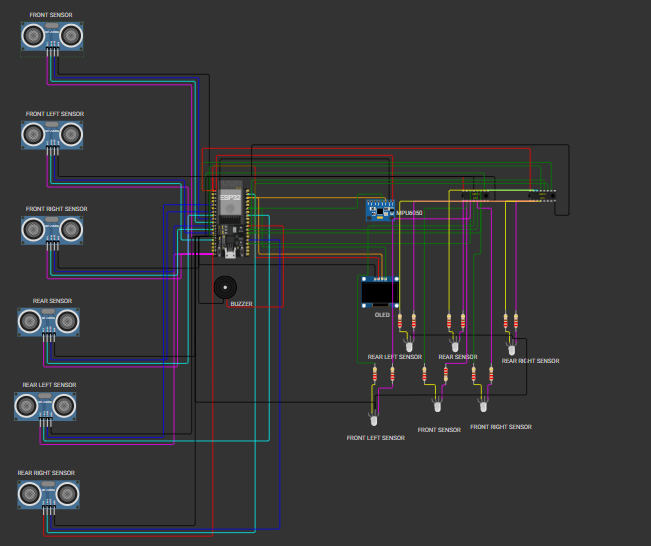

# esp32-ultrasonic-oled-radar
# HexaShield-Radar 🚀/HexaTrack-ESP32/SonicArray-6Z/HexaSense-Radar/MultiScan-Shield/ProxiShield-6Z/HexaGuard-Radar

An interactive multi-zone proximity monitoring system simulated in Wokwi using an ESP32. The system tracks distance threats across 6 individual zones, relying on a high-priority active audio buzzer alarm system to flag close-range hazards while tracking live device orientation via an IMU sensor.

---

## 🌍 Universal Vehicle Safety Application
This project is designed as a **Universal, Low-Cost Safety Model** that can be easily scaled and retrofitted onto virtually any vehicle platform. Whether installed on **compact cars, commercial delivery trucks, heavy transport vehicles, or construction equipment**, it serves as an affordable driver-assistance solution. 

By utilizing accessible components like the ESP32 and highly efficient shift registers, this system brings high-end multi-zone blind-spot tracking and collision avoidance to everyone, significantly reducing accident rates without requiring expensive factory upgrades.

---

## 🚀 Practical Applications
Because of its flexible, 6-zone scanning matrix and low cost, this system is highly effective for:

* **Commercial Fleet & Truck Blind-Spot Detection:** Monitors the vast blind spots along the sides and rear of long cargo trucks or delivery vans, alerting drivers to hidden cyclists or smaller vehicles during tight turns.
* **Low-Cost Reverse Parking Assistant:** Provides older or budget-friendly car models with a comprehensive 360-degree parking radar framework, complete with clear audio tones and directional visual alerts.
* **Heavy Machinery Safety Zones:** Deployed on construction vehicles, excavators, or forklifts to instantly warn operators if ground crew members or static obstacles enter their hazardous swinging or moving radius.
* **Agricultural Equipment Navigation:** Assists tractors and harvesters operating in low-visibility field conditions by tracking physical barriers, terrain drops, or fence boundaries.

---

## ⚡ Live Interactive Simulation
You can launch, inspect, and run this entire circuit directly in your browser without installing any software:

👉 **[Click Here to Run the Simulation on Wokwi](https://wokwi.com/projects/from/github/Maithra08/esp32-ultrasonic-oled-radar)**

---

## 🛠️ Components List
* **Microcontroller:** ESP32 DevKit C V4
* **Proximity Sensors:** 6x HC-SR04 Ultrasonic Distance Sensors (Front, Front Left, Front Right, Rear, Rear Left, Rear Right)
* **Audio Alert (Primary):** Active Piezo Buzzer for immediate critical threat detection
* **Visual Display:** SSD1306 128x64 I2C OLED Screen
* **Telemetry Sensor:** MPU6050 6-Axis Motion Tracking IMU (Accelerometer & Gyro)
* **Secondary Indicators:** 6x Common-Cathode RGB LEDs driven by a 2x Cascaded 74HC595 Shift Register array

---

## 🧠 How It Works
The ESP32 continuously loops through and fires all 6 ultrasonic sensors to scan the surrounding space. The system prioritizes immediate audio alarms for close-range hazards while shifting color indicators dynamically based on target proximity:

1. **🟢 Safe Scanning State (Distance > 50 cm):** 
   * The active buzzer remains **silent**.
   * The OLED displays live tilt telemetry (X and Y acceleration) from the MPU6050 sensor.
   * The RGB proximity indicators stay solid **Green**.

2. **🟡 Caution State (Distance between 30 cm and 50 cm):** 
   * The active buzzer remains **silent**.
   * The RGB tracking indicator for the active zone shifts dynamically to **Yellow** (combining the Red and Green channels) to monitor the approaching target.

3. **🚨 Primary Danger Alarm State (Distance < 30 cm):** 
   * **Buzzer Activation:** The active piezo buzzer instantly sounds a continuous, high-priority audio alert tone. 
   * **OLED Override:** The screen immediately clears out the telemetry data to draw a geometric **Warning Triangle Symbol** and text identifying the specific threat zone (e.g., `ALARM: FRONT LEFT SENSOR`) along with the exact distance.
   * **LED Shift:** The zone's RGB indicator switches directly to bright **Red**.
